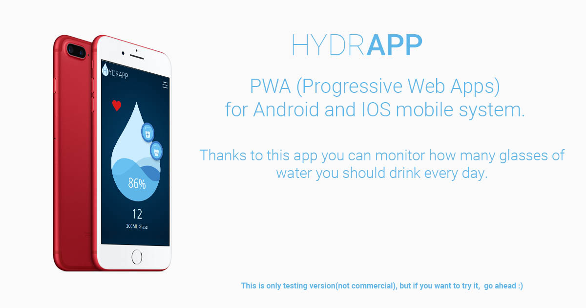

# hydrApp - PWA
If you want to know how my PWA looks like click here -> [PWA hydrApp](https://krzysztofgrudzien.github.io/hydrApp/)

## The aim of this project 🚀
The main aim of this project is creating PWA aplication using localStorage as a databases.

## What I've used here?
- 👍 Semantic HTML5.
- 👍 CSS3 (and a little bit animations) and SASS
- 👍 BEM methodology.
- 👍 Adobe XD
- 👍 JS ES6 (functions, events, localStorage).
- 👍 FLEX BOX.
- 👍 Training UX/UI design
- 👍 Solving many issues using Stack Overflow, MDM and others.

## The tools I've used:
- ✔ Visual Studio Code
- ✔ Adobe XD,
- ✔ Task runner - GULP
- ✔ Running environment - Node.js and NPM

## Rules of project 🔔 
1. Click the link I give you and install the app.
2. Add or remove the glass of drank water.
3. All drank the glasses are assigned in the memory of the App.
4. The localStorage create a history of drank water glasses and add it to the history table.
5. Every day is a new history.
4. The typical average for an adult person is 2800ml (14 glasses).
5. All statistics are based on this average.

## I wish you have a fun 🏆

## How to run my local hydrApp PWA?

If you want run my website locally, you should follow the instruction below:

`npm install -g gulp-cli`

`npm install`

`gulp`

To publish your page using github pages use `npm run deploy`
